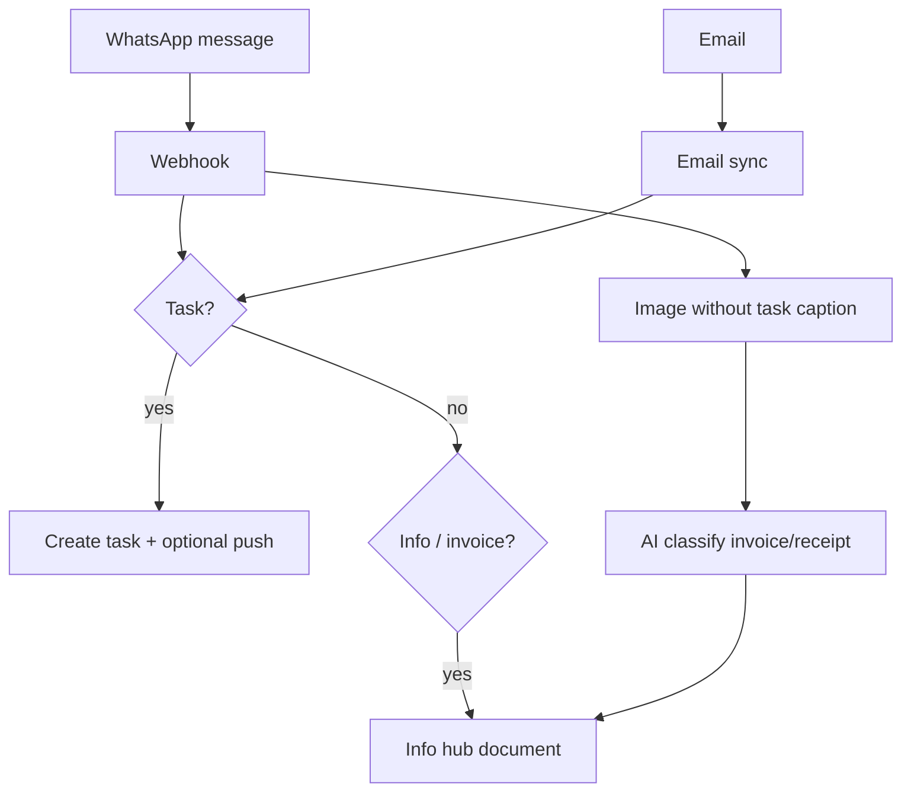

# DAOS as a Web App — Mail, WhatsApp, Tasks & Documents

## What runs where

| Channel | Listening | Where it runs |
|---------|-------------|---------------|
| **WhatsApp (Green API)** | Real-time webhooks | **Backend** `POST /webhooks/green-api` |
| **WhatsApp (Meta)** | Real-time webhooks | **Backend** `POST /webhooks/whatsapp` |
| **Email (Gmail/Outlook)** | Poll every ~15 min + on app open / web poll | **Backend** scheduler + client trigger |
| **Flutter Web** | UI + connect accounts + manual sync | Browser (GitHub Pages) |

The browser **does not** read your inbox or WhatsApp directly. The **API on Render** does ingestion; the web app shows results and triggers email sync.

## Deploy web app

- **Production:** push to `main` → GitHub Actions → https://ozklingel.github.io/DAOS-front/
- **Local:** `cd mobile` → `.\scripts\dev_web.ps1`
- **API:** `https://daos-api.onrender.com/api/v1` (set in CI `vars.API_BASE_URL`)

## Connect accounts (web)

### Outlook (recommended for web)

1. Sign in with Outlook in the app
2. Settings → Integrations → Connect Outlook
3. Azure app must include redirect: `https://ozklingel.github.io/DAOS-front/oauth/outlook` (adjust repo name)
4. Render env: `MICROSOFT_CLIENT_ID`, `MICROSOFT_CLIENT_SECRET`

Refresh token stays on the server → mail sync works with the tab closed.

### Gmail (web)

1. Google Cloud → OAuth Web client → origin `https://ozklingel.github.io` (no path)
2. Sign in / connect Gmail in Integrations
3. Prefer flow that returns **server auth code** so backend stores **refresh token**
4. Without refresh token, sync stops after ~1 hour

### WhatsApp

1. **Green API** (recommended): set `GREEN_API_ID_INSTANCE`, `GREEN_API_TOKEN` on Render
2. Webhook URL: `https://daos-api.onrender.com/webhooks/green-api`
3. In app: link phone → **Select chats** to sync
4. Incoming text, voice, **images** (invoices/receipts) are processed on the server

> One Green API instance = one WhatsApp account monitoring selected chats (not each user’s personal WA login).

## What happens to each message

- **Tasks:** LangGraph classifier (email / WhatsApp text / voice transcript)
- **Documents:** Text emails, WhatsApp text, **WhatsApp images**, camera upload → categories (finance, insurance, …)

## Web-specific behavior

- **No FCM** on web — use **2-minute poll** while tab is open (sync mail + refresh tasks/info)
- **Push notifications:** Android/iOS only
- **Render free tier:** API sleeps → first webhook/sync may be slow; use paid/always-on for production

## Backend checklist (Render)

- [ ] `DATABASE_URL`, `JWT_SECRET_KEY`, `OPENAI_API_KEY`
- [ ] `GOOGLE_CLIENT_ID` + `GOOGLE_CLIENT_SECRET`
- [ ] `MICROSOFT_CLIENT_ID` + `MICROSOFT_CLIENT_SECRET`
- [ ] `GREEN_API_*` or Meta `WHATSAPP_*`
- [ ] `FIREBASE_CREDENTIALS_PATH` (mobile push only)
- [ ] Green webhook pointed at `/webhooks/green-api`

## Next improvements (roadmap)

1. Gmail Pub/Sub / Graph subscriptions → near-instant email
2. Email attachments (PDF) → invoice pipeline
3. Web Push or SSE for live UI updates without polling
4. Per-user WhatsApp model (if product requires it)
